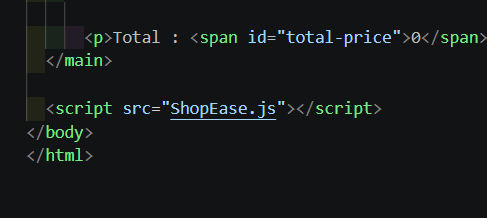
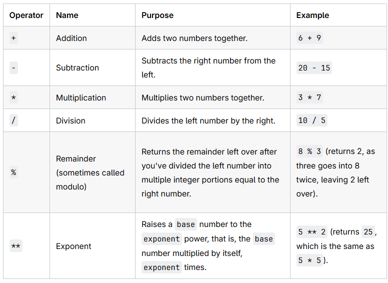
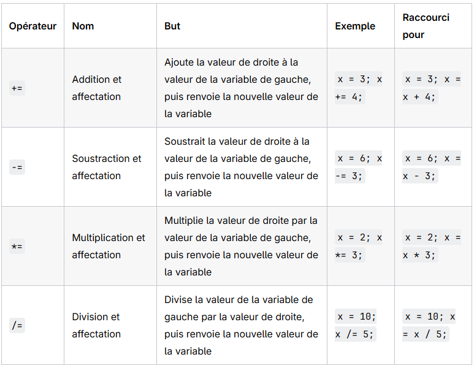

# JavaScript Basis

JavaScript (JS) : est un langage de programmation côté client. Il permet de rendre les
pages web interactives et dynamiques (modifier le contenu, réagir aux clics, animer des
éléments) sans avoir besoin de recharger la page.

Où écrire du JavaScript ?

Le JavaScript s'exécute directement dans le navigateur. Il s'intègre généralement dans une page HTML avec des balises `<script>`. 



## 1. Débuter avec Js

### - Basic syntax
- JavaScript is case-sensitive. Lines end by `;`
 - Block are delimited curly brackets by `{ }`
 - Comments are between `/* */` for multiple lines or after `//` for one line.

### - Affichage 

- `console.log("Coucou");`

Affiche des informations dans la console du navigateur ou de l'environnement d'exécution (comme Node.js).

C'est l'outil essentiel du développeur pour le débogage. Il permet de vérifier la valeur d'une variable ou le flux d'exécution du programme sans affecter l'interface utilisateur.

- `alert("Hello World !");`

Affiche une pop-up directement à l'utilisateur.

Principalement utilisé pour les messages d'avertissement ou de confirmation simples, mais il est souvent évité dans les applications modernes pour une meilleure expérience utilisateur.

## 2. Variables & Types de données

### Declare a variable with:
- `Const` - Valeur qui ne change pas
- `Let` - Valeur qui change
- *`Var`- Ancienne manière de déclarer. A éviter*

*Example :*

```js
const firstName = "Pauline"; // Ne peut pas être modifier
let age = 38;                
let etudiante = true;        // Peut être modifié  
```

<!-- termynal -->

```
$ node
> const nomProduit = "Clavier"
undefined
> let prixHT = 45
undefined
> prixHT = 39
39
> nomProduit = "Souris"
Uncaught TypeError: Assignment to constant variable.
# const refuse d'être réaffecté, let l'accepte
```
---

### - Types
- `String`- Text that is wrap it in `''`or `""`
- `Number`- 2 types of numbers: `integer (30)` and `floating (5.2)`
- `Boolean`- To test a condition `(true of false)`
- `Undefined` -	Variable déclarée mais non définie	let x;
- `Null` -	Valeur intentionnellement vide	let y = null;

<!-- termynal -->

```
> typeof "Clavier"
'string'
> typeof 45
'number'
> typeof true
'boolean'
# Le piège du + avec une chaîne
> 45 + 3
48
> "Prix : " + 45
'Prix : 45'
```

---


*Example :*

```js
let welcomeMessage = "Hello Pauline !"; 
// String (Chaîne de caractère) 
let age = 38;                          // Number 
let etudiante = true;                 // Boolean (true/false)
```

### - String concatenation
Assembler des morceaux de texte et variables.

#### Simple concatenation

*Example :*

```js
const prenom = "Pauline";
const nom = "Bennoin";

// On additionne les variables et un espace au milieu
const nomComplet = prenom + " " + nom; 

console.log(nomComplet); // Résultat : "Pauline Bennoin"
```

#### Backsticks concatenation
Utilise les `backsticks (``) et variables ($)` pour insérer directement les variables. C'est la méthode moderne et recommandé car plus lisible.

```js
const prenom = "Pauline";
const nom = "Bennoin";

const nomComplet = `${prenom} ${nom}`;

console.log(nomComplet); // Affiche : "Pauline Bennoin"
```

⚠️**CAUTION** <br>
Pour inclure une apostrophe ( ' ) dans une chaine délimité par des guillets simple ( ' ), il faut l'échapper avec un anti-slash ( \ ).

```js
const phrase = 'C\'est le dossier de pauline bennoin';
console.log(phrase); // Affiche : C'est le dossier de pauline bennoin
```

### - Other types
- `Array` - Liste ordonnée de valeurs. Commence à partir de **l'index 0**.


*Example :*

```js
let user = ["Je","Pauline", 38, true]; 

console.log(user[1]);    // Affiche l'élément à l'index 1 (soit Pauline)

```
```text
> let user = ["Je", "Pauline", 38, true]; 
> console.log(user[1]);
Pauline
```

- `Object` - Ensemble de données non ordonné sous forme de propriétés (clé: valeur)

*Example :*

```js
let user = {
    name:"Pauline",     // clé: name et valeur: "Pauline"
    age: 38,
    school:"La Fabrique du Numérique}; 

console.log(user.age);  // Accès à la valeur par le nom de la clé
```
```js
// Ajouter une propriété à un objet:
user.nickname = "Paupau"
```


## 3. Operators 

### a. Opérateurs Arithmétiques
Arithmetic operators are used for performing mathematical calculations in JavaScript.



### b. Opérateurs d'affectation (raccourcis)
Permet de modifier la valeur d'une variable en utilisant sa valeur actuelle



### c. Opérateurs d'égalité
- `Egalité simple (==)` : Convertit automatiquement les types si nécessaire, puis compare uniquement les valeurs.

*Example :*
```js
//  Égalité simple (convertit les types) 
let a = ("2" == 2);    // true  (Les valeurs se ressemblent)
let b = ("2" != 2);    // false (Ils ne sont pas différents en valeur)
```

- `Egalité stricte (===)` : Compare à la fois la **valeur** ET le **type** de la donnée (texte, nombre, etc.).

*Bonne pratique : Prenez l'habitude de toujours utiliser l'égalité stricte (=== et !==). Cela permet d'éviter de nombreux bugs et erreurs inattendues dans votre code !*

*Example :*

```js

// Égalité stricte (vérifie le type ET la valeur)
let c = ("2" === 2);   // false (L'un est du texte, l'autre est un nombre !)
let d = ("2" !== 2);   // true  (Ils sont bien strictement différents)
```

### d. Opérateurs de comparaison
Tout comme en mathématiques, les opérateurs de comparaison fonctionnent de la même manière que dans la plupart des autres langages de programmation.

*Note: ces opérateurs peuvent également être utilisés pour comparer du texte (chaînes de caractères) selon l'ordre alphabétique.*

[Opérateur de comparaison](../Images/OperateurComparaison.png) 

*Example:*

```js
// Comparaison de nombres 
let a = (2 > 2);          // false (Strictement supérieur)
let b = (2 <= 2);         // true  (Inférieur ou égal)
let d = (2 < 2);          // false (Strictement inférieur)
let e = (2 <= 2);         // true  (Inférieur ou égal)

// Comparaison avec conversion (texte vs nombre) 
let c = ("2" >= 2);       // true  (Le texte "2" est converti en nombre pour comparer)

// Comparaison de texte (ordre alphabétique) 
let f = ('abc' < 'def');  // true  (La lettre 'a' vient avant 'd' dans l'alphabet)
```

### e. Opérateurs logiques

- `ET (&&)` : La condition entière n'est vraie que si toutes les sous-conditions sont vraies.

*Example:*

```js
if (x < y && x > 3) { /* ... */ } 
// Vrai seulement si x est à la fois PLUS PETIT que y ET PLUS GRAND que 3.
```

- `OU (||)` : La condition entière est vraie si au moins une des sous-conditions est vraie.

*Example:*

```js
if (x < y || x > 5) { /* ... */ } 
// Vrai si x est PLUS PETIT que y OU PLUS GRAND que 5.
```


## 4.Statements
### a. Conditions
Les conditions permettent d'exécuter du code différemment en fonction de conditions.

#### `- if / else if / else`:

- Le `if` est obligatoire (c'est le point d'entrée)
- Le `else if` est optionnel (on peut en mettre autant qu'on veut entre le if et le else).
- Le `else` est optionnel (il n'a jamais de condition entre parenthèses, il attrape tout le reste). Si aucune condition n'est vraie, le bloc **else** est exécuté


*Example:*

```js
let heure = 14;

if (heure < 12) {
  console.log("Bonjour !"); 
  // S'affiche si l'heure est inférieure à 12

} else if (heure < 18) {
  console.log("Bon après-midi !"); 
  // S'affiche entre 12 et 17

} else {
  console.log("Bonsoir !"); 
  // S'affiche sinon (18 et plus)
}
```
#### `- Switch`

`Switch`est une alternative à la condition `if / else if / else`.
Utile pour comparer une seule variable à plusieurs valeurs précises (par exemple : vérifier un rôle utilisateur, un jour de la semaine, ou un statut).

*Example:*

Imaginons que nous voulons dire à un conducteur ce qu'il doit faire en fonction de la couleur du feu.
```js
let couleurDuFeu = "rouge";

switch (couleurDuFeu) {
  case "vert":
    console.log("Vous pouvez avancer.");
    break;

  case "orange":
    console.log("Ralentissez et préparez-vous à vous arrêter.");
    break;

  case "rouge":
    console.log("Arrêtez-vous immédiatement !"); 
    break;

  default:
    console.log("Le feu est en panne, soyez très prudent.");
}
```

#### `- Négation (!)`

L'opérateur `!` inverse la valeur booléenne : `!true` devient `false`, et `!false` devient `true`.

*Example:*

```js
let quizTermine = false;

if (quizTermine === false) {
    console.log("Le quiz est toujours en cours...");
}

if (!quizTermine) {
    console.log("Le quiz est toujours en cours...");
}
// Se lit: "Si le quiz N'EST PAS terminé".
```

### b. Boucles
Les boucles servent à répéter une séquence d'instructions un certain nombre de fois.

#### - `While`

Tant que la condition est `true`, elle exécute le bloc `{}`.

Dès que la condition devient false, elle s'arrête immédiatement.

*Example:*

```js

let compteur = 0; 
// 1. Initialisation hors de la boucle

while (compteur < 5) { 
// 2. Condition vérifiée avant d'entrer
    console.log("Tour numéro : " + compteur);
    
    compteur++; 
// 3. Modification (sinon boucle infinie !)
}
```

⚠️ Le piège classique : La boucle infinie

*Si vous oubliez de modifier la variable dans le bloc (ici compteur++), la condition restera toujours vraie et votre navigateur plantera (ou tournera en boucle indéfiniment).*

#### - `Do...while`

Dans un while classique, si la condition est fausse dès le départ, le code à l'intérieur ne s'exécute jamais.

La boucle `do...while` a une particularité : elle exécute le bloc de code au moins une fois, puis vérifie la condition à la fin de chaque tour.


*Example:*

```js
let motDePasse = "";

do {
    // S'exécute toujours AU MOINS une fois
    motDePasse = prompt("Entrez le mot de passe :");
} while (motDePasse !== "secret123");

console.log("Accès accordé !");
```

#### - `for`
C'est la boucle la plus courante, idéale lorsque vous savez combien de fois vous devez itérer.

*Example:*

```js
for (let i = 0; i < 10; i++) { 
// i++ est un pas de 1
// ... code à exécuter 10 fois ...
}
```

- `Initialisation (let i = 0)` : Exécutée une seule fois au début.

- `Condition (i < 10)` : Vérifiée avant chaque itération. Si elle est fausse, la boucle s'arrête.

- `Incrémentation/Décrémentation (i++)` : Exécutée après chaque itération.


#### - `Utilisation pour parcourir un tableau`

`.length` indique le nombre total d'éléments présents dans un tableau (ou le nombre de caractères dans une chaîne de texte).

Comment ça fonctionne ? JavaScript compte automatiquement les éléments.

*Example:*

```js
let fruits = ["pomme", "banane", "orange"];

// Affiche 3 (car il y a 3 éléments)
console.log(fruits.length); 
```

Pourquoi l'utilise-t-on dans une boucle `for` ?

En JavaScript, le premier élément d'un tableau est toujours à l'index 0. 
Si un tableau contient 3 éléments :
- Le 1ᵉʳ est à l'index 0
- Le 2ᵉ est à l'index 1Le 3ᵉ est à l'index 2
- Le dernier index accessible est donc toujours length - 1.
 *(ici 3 - 1 = 2)*

```Js
let fruits = ["pomme", "banane", "orange"]; // length = 3

for (let i = 0; i < fruits.length; i++) {
    console.log(fruits[i]);
}
```
Déroulement pas à pas :
- Tour 1 : i = 0 → 0 < 3 (vrai) → affiche fruits[0] (pomme), puis i passe à 1.
- Tour 2 : i = 1 → 1 < 3 (vrai) → affiche fruits[1] (banane), puis i passe à 2.
- Tour 3 : i = 2 → 2 < 3 (vrai) → affiche fruits[2] (orange), puis i passe à 3.
- Arrêt : i = 3 → 3 < 3 (faux) → la boucle s'arrête exactement au bon moment sans dépasser.

Les deux grands avantages:

- **Dynamique** : Si vous ajoutez ou supprimez des questions dans votre quiz plus tard, vous n'avez pas besoin de changer le chiffre dans la boucle, tab.length s'adapte automatiquement.
- **Évite les erreurs undefined** : Si vous alliez trop loin (par exemple jusqu'à i <= 3), fruits[3] n'existerait pas et renverrait `undefined`.

## 5.Functions
Une fonction est un bloc de code réutilisable conçu pour effectuer une tâche précise. 

### a. Anatomie et déclaration d'une fonction
Une déclaration de fonction est la méthode classique pour définir un bloc d'instructions réutilisable sous un nom précis.

Une fonction repose sur 4 notions clés :

- `Le nom` : identifie l'action (en général un verbe : calculerScore, changerCouleur).

- `Les paramètres` : les variables d'entrée (« les ingrédients ») placées entre parenthèses.

- `Le corps {}` : les instructions exécutées lors de l'appel.

- `Le retour (return)` : le résultat final que la fonction renvoie (« le plat cuisiné »).


*Example:*

```js
// 1. Déclaration de la fonction

// "saluer" -> NOM de la fonction : il identifie l'action.
// "(nom)" -> PARAMÈTRE : c'est la variable d'entrée que la fonction va utiliser.
function saluer(nom) { 
  
  // Les accolades { ... } délimitent LE CORPS de la fonction : 
  // elles contiennent le bloc d'instructions qui sera exécuté à chaque appel.
  
  return "Salut " + nom + " !";
  // "return" est LE RETOUR : c'est l'instruction qui indique le résultat 
  // final que la fonction doit renvoyer vers l'endroit où elle a été appelée. 
  
}

// 2. Appel de la fonction
// On appelle la fonction par son nom en lui passant la valeur "Thomas" pour le paramètre.
let message = saluer("Thomas");
console.log(message); // Affiche : "Salut Thomas !"
```

<!-- termynal -->

```
# Forme classique
> function calculerTotalHT(prix, quantite) { return prix * quantite }
undefined
> calculerTotalHT(45, 3)
135
# Forme fléchée, plus courte
> const calculerTTC = (montant) => montant * 1.2
undefined
> calculerTTC(135)
162
```

#### - Paramètres vs Arguments

- `Paramètre` : la variable définie lors de la création de la fonction.
- `Argument` : la valeur réelle fournie lors de l'appel.

```Js
// 'prenom' et 'points' sont des PARAMÈTRES
function afficherScore(prenom, points) {
    console.log(`${prenom} a obtenu un score de ${points}/10.`);
}

// "Pauline" et 8 sont les ARGUMENTS passés à la fonction
afficherScore("Pauline", 8); // Affiche : "Pauline a obtenu un score de 8/10."
afficherScore("Lucas", 5);   // Réutilisation immédiate avec d'autres valeurs !
```

#### - Le rôle de return : Renvoyer une valeur
Une fonction peut soit réaliser une action (afficher un message, modifier le DOM), soit produire une valeur réutilisable avec return.

```Js
// Fonction sans return : elle agit, mais ne "donne" rien au reste du code
function saluer(nom) {
    console.log("Bonjour " + nom);
}

let resultat1 = saluer("Alice"); 
// Affiche "Bonjour Alice"
console.log(resultat1);
// Affiche undefined !


// Fonction AVEC return : elle calcule et rend la valeur
function calculerPourcentage(score, total) {
    let calcul = (score / total) * 100;
    return calcul;
    // Renvoie le résultat au code qui a appelé la fonction
}

let monPourcentage = calculerPourcentage(7, 10); // monPourcentage reçoit 70
console.log(`Votre taux de réussite est de ${monPourcentage}%.`);
```
⚠️ Règle clé : L'instruction `return` met fin immédiatement à la fonction. Tout code situé après un return dans le même bloc ne sera jamais exécuté.

### b. Appel et utilisation de la fonction
 
 Déclarer une fonction ne l'exécute pas : il faut obligatoirement l'appeler par son nom en lui transmettant ses arguments entre parenthèses :  
 
 ```Js
 // Appel de la fonction avec l'argument "Thomas"
let message = saluer("Thomas");

console.log(message); // Affiche : "Salut Thomas !"
```
- Lors de l'appel **saluer("Thomas")**, la valeur "Thomas" est transmise au paramètre nom.
- La fonction s'exécute, assemble la phrase **"Salut Thomas !"** et la renvoie grâce à return.
- La variable message récupère ce résultat pour pouvoir l'afficher ou le réutiliser dans le reste du programme.


#### c. Fonction classique VS Fonction fléchée

En JavaScript, il existe deux manières principales d'écrire une fonction : la déclaration classique (avec le mot-clé function) et la fonction fléchée (arrow function, introduite avec la norme ES6 en 2015). 

##### - Fonction classique (déclarative)

C'est la syntaxe historique. On utilise le mot-clé function suivi du nom de la fonction : 
```Js
 function calculerTTC(montant) {
  return montant * 1.2;
}
```
Avantages : Très lisible, explicite et bénéficie du hoisting (on peut appeler la fonction plus haut dans le fichier, avant même sa déclaration).  Usage typique : Les fonctions principales du programme (ex. calculerTotalHT, verifierReponse).  2. La fonction fléchée (=>)La fonction fléchée stocke une fonction anonyme dans une constante (const). Elle se caractérise par la flèche => :  JavaScript// 1. Version complète
const calculerTTC = (montant) => {
  return montant * 1.2;
};

// 2. Version courte (return implicite)
const calculerTTC = (montant) => montant * 1.2;
Les règles d'allègement de la syntaxe :Accolades et return facultatifs (une seule instruction) : S'il n'y a qu'une seule expression à exécuter, on retire les accolades {} et le mot-clé return. La valeur calculée est automatiquement renvoyée (c'est le retour implicite).  Parenthèses facultatives (un seul paramètre) : S'il n'y a qu'un unique paramètre (ici montant), les parenthèses autour de lui peuvent être omises : montant => montant * 1.2.


## 3. Écrire des fonctions


---

## 4. Les blocs

<!-- termynal -->

```
$ cat bloc.js
if (true) {
  const message = "Bonjour";
  console.log(message);
}
console.log(message);
$ node bloc.js
Bonjour
ReferenceError: message is not defined
# La variable n'existe qu'entre les accolades qui l'entourent
```


# Quiz – Atelier 1

<!-- mkdocs-quiz intro -->

<quiz>
Quel mot-clé utilise-t-on pour une valeur qui ne changera jamais ?

- [x] `const`
- [ ] `let`
- [ ] `var`
- [ ] `final`

En JavaScript moderne, la règle est : `const` par défaut, `let` uniquement quand la valeur doit être modifiée. `var` est l'ancienne syntaxe, on ne l'utilise plus.
</quiz>

<quiz>
Que vaut `typeof "45"` ?

- [ ] `'number'`
- [x] `'string'`
- [ ] `'text'`
- [ ] `45`

Les guillemets font toute la différence : `45` est un nombre, `"45"` est une chaîne de caractères contenant deux chiffres.
</quiz>

<quiz>
Qu'affiche `console.log("Prix : " + 45)` ?

- [ ] `45`
- [x] `Prix : 45`
- [ ] `Prix : 45` avec une erreur
- [ ] `NaN`

Dès qu'un des deux opérandes est une chaîne, le `+` ne fait plus une addition mais une **concaténation** : le nombre est converti en texte.
</quiz>

<quiz>
Quels types font partie des types de base de JavaScript ?

- [x] `number`
- [x] `string`
- [x] `boolean`
- [ ] `integer`

JavaScript ne distingue pas les entiers des décimaux : tout est `number`. Les autres types de base sont `undefined`, `null`, `symbol` et `bigint`.
</quiz>

<quiz>
Que manque-t-il à cette fonction pour être utilisable dans un calcul ?

```js
function calculerTotal(prix, quantite) {
  console.log(prix * quantite);
}
```

- [ ] Rien, elle est correcte
- [x] Un `return` à la place du `console.log`
- [ ] Un point-virgule
- [ ] Le mot-clé `const`

Elle affiche le résultat mais ne le **renvoie** pas : `calculerTotal(45, 3) * 1.2` donnerait `NaN`. Une fonction de calcul retourne une valeur, elle n'affiche rien.
</quiz>

<quiz>
Qu'affiche ce code ?

```js
if (true) {
  const message = "Bonjour";
}
console.log(message);
```

- [ ] `Bonjour`
- [ ] `undefined`
- [x] Une erreur : `message is not defined`
- [ ] Rien du tout

Une variable déclarée avec `const` ou `let` n'existe qu'à l'intérieur de son bloc, c'est-à-dire entre les accolades qui l'entourent. En dehors, elle n'existe plus.
</quiz>

<quiz>
La forme courte pour écrire une fonction, avec le symbole `=>`, s'appelle une fonction [[fléchée]].

Exemple : `const doubler = (n) => n * 2;`
</quiz>

<!-- mkdocs-quiz results -->


# TEST - Atelier 1 – Découvrir les bases de JavaScript

!!! info "En bref"
    **Durée : 15 min** · **Prérequis :** Node.js installé · **Fichier :** `atelier1.js`
    · **Exécution :** `node atelier1.js`

## Objectif

Créer une petite fiche produit pour une boutique, en manipulant les quatre
briques de base du langage : **variables**, **types**, **fonctions**, **blocs**.

Créez un fichier `atelier1.js` et avancez partie par partie. Après chaque
partie, relancez `node atelier1.js` pour vérifier que tout fonctionne encore.

---

## Partie 1 — Déclarer des variables (3 min)

Déclarez trois variables :

- `nomProduit` : le nom du produit, une chaîne de caractères. Il ne changera
  jamais, donc utilisez `const`.
- `prixHT` : le prix hors taxes, un nombre. Il pourra changer : utilisez `let`.
- `quantite` : la quantité commandée, un nombre, en `let` également.

Affichez-les avec `console.log()`.

??? success "Corrigé"
    ```js
    const nomProduit = "Clavier";
    let prixHT = 45;
    let quantite = 3;

    console.log(nomProduit, prixHT, quantite);
    ```
    Règle simple à retenir : **`const` par défaut, `let` seulement si la valeur
    doit changer.** On n'utilise plus `var` en JavaScript moderne.

---

## Partie 2 — Observer les types (4 min)

JavaScript ne demande pas de déclarer le type d'une variable : il le déduit.
L'opérateur `typeof` permet de le vérifier.

1. Affichez le type de chacune de vos trois variables.
2. Ajoutez `console.log(typeof true);` et `console.log(typeof rienDuTout);`
   (une variable jamais déclarée).
3. Testez enfin ces deux lignes et comparez le résultat :

```js
console.log(prixHT + quantite);
console.log("Prix : " + prixHT);
```

Que s'est-il passé sur la deuxième ligne ?

??? success "Corrigé"
    Les types affichés sont `string`, `number`, `number`, `boolean`, puis
    `undefined`.

    La première ligne fait une addition (`48`), la seconde une **concaténation**
    (`Prix : 45`). Le signe `+` change de sens dès qu'une chaîne est en jeu : il
    convertit alors le nombre en texte. C'est la source d'erreur la plus
    fréquente chez les débutants.

---

## Partie 3 — Écrire des fonctions (5 min)

Écrivez deux fonctions, chacune sous une forme différente :

| Fonction | Forme | Rôle |
| -------- | ----- | ---- |
| `calculerTotalHT(prix, quantite)` | déclaration `function` | renvoie `prix × quantite` |
| `calculerTTC(montant)` | fonction fléchée `=>` | renvoie le montant avec 20 % de TVA |

Attention : vos fonctions doivent **renvoyer** (`return`) une valeur, pas
l'afficher. C'est l'appelant qui décide quoi en faire.

Testez avec vos variables : le total HT doit valoir `135` et le TTC `162`.

??? success "Corrigé"
    ```js
    function calculerTotalHT(prix, quantite) {
      return prix * quantite;
    }

    const calculerTTC = (montant) => montant * 1.2;

    console.log(calculerTotalHT(prixHT, quantite));           // 135
    console.log(calculerTTC(calculerTotalHT(prixHT, quantite))); // 162
    ```
    Les deux formes font la même chose. La fonction fléchée est simplement une
    écriture plus courte, très répandue dans le code moderne.

---

## Partie 4 — Comprendre les blocs (3 min)

Un **bloc** est tout ce qui se trouve entre `{` et `}`. Une variable déclarée
avec `let` ou `const` n'existe qu'à l'intérieur de son bloc.

Testez ce code et observez l'erreur :

```js
if (quantite > 0) {
  const message = "Commande valide";
  console.log(message); // fonctionne
}

console.log(message); // ?
```

Corrigez-le pour que l'affichage final fonctionne, **sans supprimer le `if`**.

??? success "Corrigé"
    La dernière ligne lève `ReferenceError: message is not defined` : `message`
    est mort en même temps que le bloc `if`.

    On déclare la variable **avant** le bloc :

    ```js
    let message = "Commande vide";

    if (quantite > 0) {
      message = "Commande valide";
    }

    console.log(message);
    ```

---

## Partie 5 — Assembler (bonus, si le temps le permet)

Écrivez une fonction `afficherFiche()` qui utilise tout ce qui précède et
affiche exactement :

```text
Clavier — 3 x 45 € = 135.00 € HT (162.00 € TTC)
```

Indice : `montant.toFixed(2)` formate un nombre avec deux décimales.

??? success "Corrigé"
    ```js
    function afficherFiche() {
      const totalHT = calculerTotalHT(prixHT, quantite);
      const totalTTC = calculerTTC(totalHT);
      console.log(
        `${nomProduit} — ${quantite} x ${prixHT} € = ${totalHT.toFixed(2)} € HT (${totalTTC.toFixed(2)} € TTC)`
      );
    }

    afficherFiche();
    ```
    Les backticks ` `` ` créent un *template literal* : on y insère des valeurs
    avec `${...}`, sans concaténation.

---

## Ce que vous devez savoir faire en sortant

- [ ] Déclarer une variable avec `const` ou `let` et choisir entre les deux.
- [ ] Vérifier le type d'une valeur avec `typeof`.
- [ ] Expliquer pourquoi `"Prix : " + 45` ne donne pas un nombre.
- [ ] Écrire une fonction qui `return` un résultat, sous deux formes.
- [ ] Dire où commence et où finit la vie d'une variable de bloc.
