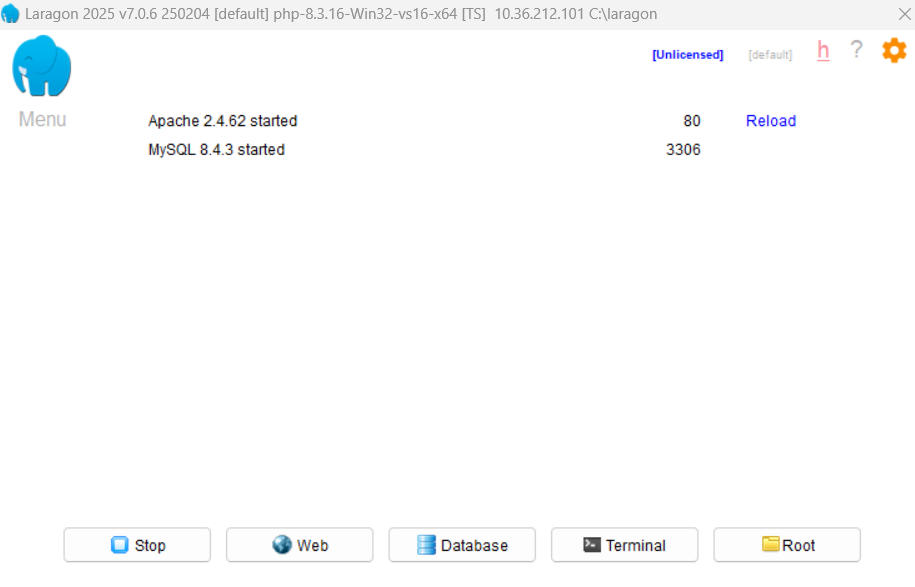

# How to open a project in PHP ?

- 1. Démarrer le serveur `Laragon`

Ouvre Laragon et clique sur le bouton `Start all` (Start All). Cela lance Apache (le serveur web) et MySQL (la base de données, dont tu n'as pas encore besoin, mais c'est bien de l'avoir prêt).

-  2. Créer le dossier du projet

Sur ton ordinateur, va dans le répertoire racine de Laragon. Par défaut, c'est `C:\laragon\www.` Crée un nouveau dossier à l'intérieur de www et donne-lui un nom sans espace, par exemple `mon_premier_projet`.

- 3. Ouvrir le projet dans VS Code

Fais un clic droit sur le dossier mon_premier_projet et sélectionne Ouvrir avec Code (ou ouvre VS Code manuellement, puis fais Fichier > Ouvrir le dossier).

- 4. Créer le fichier d'entrée

Dans VS Code, crée un nouveau fichier nommé `index.php.` Le nom "index" est spécial : c'est le fichier que le serveur web cherchera et exécutera par défaut quand tu accèderas au dossier.

- 5. Voir le résultat dans le navigateur

Écris `<?php echo "Bonjour tout le monde !"; ?>` dans ton fichier et sauvegarde. Ouvre ton navigateur web et tape l'adresse générée par Laragon : http://mon_premier_projet.test (si ça ne marche pas, utilise http://localhost/mon_premier_projet).
