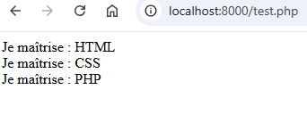
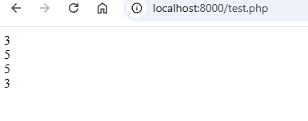
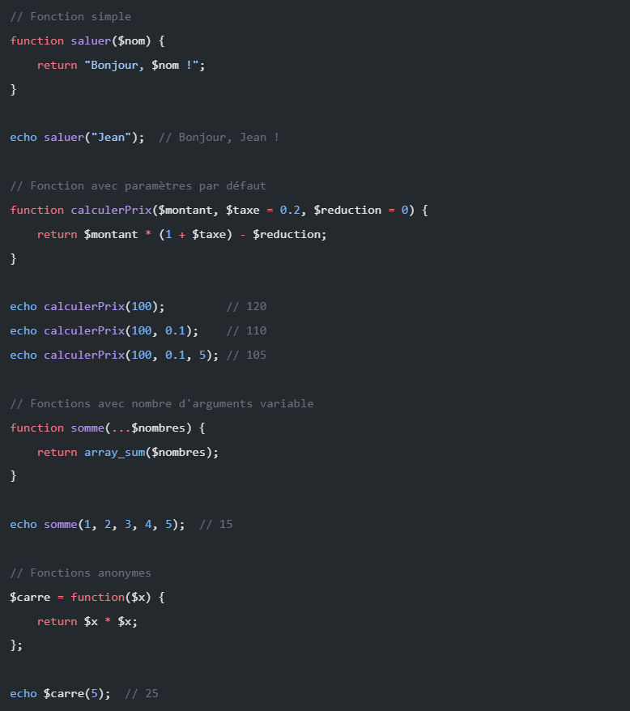

# Les fondamentaux de PHP

PHP (Hypertext Preprocessor) est un langage de programmation côté serveur populaire, particulièrement adapté au développement web


## Intro: L'utilisation de PHP

- `Langage côté serveur`: Le code est exécuté sur le serveur avant d’envoyer le HTML au client
- `Intégration avec HTML`: Peut être directement intégré dans les pages HTML
- Compatibilité avec les bases de données

## 1. Syntaxe et structure de base

- A PHP script starts with `<?php` and ends with `?>`
```php
<?php
  // Ton code PHP va ici
?>
```
- Les commentaires
```php
<?php

// Commentaires sur une ligne
/*
 Commentaire sur plusieurs lignes
 */
?>
```

- Chaque instruction se termine par un point-virgule `;`
- `echo` - affiche le rendu sur le navigateur (HTML)
```php
<?php
// L'instruction 'echo' permet d'afficher du texte ou du HTML à l'écran
  echo "<p style='color:red'>Bonjour tout le monde !</p>";
?>
```  


- `<br>`- Saut de ligne HTML
```php
<?php
echo "<p style='color:red'>Bonjour tout le monde !</p>"; 
echo '<br>';
echo "Je suis Pauline"
?>
```  


- `phpinfo();` - Affiche toutes les infos du php courant

- `die();` fonction die pour stopper l'exécution du script
```php
if(1!=1){
die();
}
```

- PHP keywords (e.g. if, else, echo, etc.), classes, functions, and user-defined functions are `not case-sensitive`

- Intégration en HTML


## 2. Afficher des informations: `echo` VS `var_dump`

- `echo` - Envoie du texte ou du HTML au navigateur.

⚠️ **Attention** : echo ne prend en charge que les valeurs simples (les booléens, les nombres, et les chaînes de caractères - string). Il "plantera" si tu essaies de lui donner un tableau complexe.

```php
<?php
$nombre = 12;
$isTrue = true;
$string = "Hello";

// Echo affiche ces valeurs simples 
echo $nombre . "<br>";
echo $isTrue . "<br>";
echo $string . "<br>";
?>
```

- `var_dump` - pour le Debug.

C'est l'outil du développeur. Il sert à fouiller dans une variable pour afficher toutes ses infos (son type, sa taille, sa valeur). C'est indispensable pour **lire des tableaux**. *(L'équivalent du console.log en JS)*.

```php
<?php
$tableau = [1, 2, 3, 4];

// Affichage brut (sans la balise <pre>)
var_dump($tableau);

// Affichage propre (FORTEMENT RECOMMANDÉ)
// En encadrant le var_dump avec la balise HTML <pre>, l'affichage devient indenté et très lisible !
echo "<pre>";
var_dump($tableau);
echo "</pre>";
?>
```


- L'alternative : `print_r`

Ancienne fonction qui permet aussi d'afficher le contenu d'un tableau de manière lisible. Elle donne moins d'informations techniques que var_dump.
*À connaître pour lire du vieux code, mais beaucoup moins utilisé aujourd'hui.*

```php
PHP
<?php
print_r($tableau);
?>
```

## 3. Variables & Types de données

### a. Variables
- Commence toujours par `$`
- Pas besoin de déclarer le type (texte, nombre..), PHP le devine tout seul
- Variable are case-sensitive ($age and $AGE are 2 different variables)

```php
<?php
$prenom = "Pauline";     // String
$age = 38;              // Number (Integer)
$estConnecte = true;    // Booléen (Vrai ou Faux)

echo "Je m'appelle " . $prenom . " et j'ai " . $age . " ans."; 
// Le point (.) sert à "concaténer" (coller) des textes et des variables ensemble.
?>
```

### b. Constante

- Pas de symbole $ comme les variables
- S'écrit toujours en MAJUSCULES pour les différencier du reste

```php
<?php
// NOUVELLE VERSION (Recommandée, très similaire à JavaScript)
const TAUX_TVA = 20;
const SITE_NOM = "Mon Super Projet";

// ANCIENNE VERSION (Avec la fonction define, tu la verras dans de vieux codes)
define('ANCIENNE_CONSTANTE', 37);

// Affichage : ATTENTION, il n'y a pas de $ pour les appeler !
echo "Le taux de TVA est de " . TAUX_TVA . "%."; 
?>
```

### c. Manipulation des chaînes et nombres
#### - Concaténation: 
Se fait avec un point (`.`)

```php
<?php
$animal = "chat";

// Concaténation (avec le point)
echo 'J\'ai un ' . $animal . ' à la maison.'; 
?>
```

#### - Interpolation
Entre guillemets doubles `" "`, PHP lit la variable directement à l'intérieur du texte.

```php
<?php
$animal = "chat";

// Interpolation (uniquement avec les guillemets doubles " ")
echo "J'ai un $animal à la maison."; 
?>
```


## 4. Conditions
Les conditions permettent d'exécuter un bout de code seulement si une affirmation est vraie. On utilise `if` (si), `elseif` (sinon si), et `else` (sinon).
- `if` - executes some code if 1 condition is true
- `if...else` - executes some code if a condition is true and another code if that condition is false
- `if...elseif...else` - executes different codes for more than 2 conditions
- `switch statement` - selects 1 of many blocks of code to be executed

```php
<?php
$age = 15;

if ($age >= 18) {
    echo "Tu es majeur.";
} elseif ($age == 17) {
    echo "C'est pour bientôt !";
} else {
    echo "Tu es mineur.";
}
?>
```
*Note : == vérifie si la valeur est identique. 
=== vérifie si la valeur ET le type de donnée sont identiques (ex: 15 === "15" est faux).*

## 5. Tableaux (Arrays)
Les tableaux permettent de ranger plusieurs informations dans une seule variable. C'est là qu'on stocke les listes. 
### a. Tableau indexé
Chaque élément est rangé dans une case numérotée (l'index commence à 0).
```php
<?php
$fruits = ["Pomme", "Banane", "Cerise"];
echo $fruits[0]; // Affiche "Pomme"
?>
```
### b. Tableau associatif
Au lieu d'utiliser des numéros, on utilise des clés nommées (des étiquettes).

*example*: 
$tab = ["clé" -> "valeur"] -> $tab ["clé"]
```php
<?php
$utilisateur = [
    "prenom" => "Pauline",
    "age" => 38,
    "ville" => "Blois"
];
echo "Elle s'appelle " . $utilisateur["prenom"]; // Affiche "Alice"
?>
```
## 6. Boucles
### a. For
- Quand on connait le nombre de tours
```php
<?php
for ($i = 0; $i < 5; $i++) {
    // i++ est un pas de 1
// ... code à exécuter 5 fois ...
    echo "Ceci est le tour numéro $i <br>";
}
?>
```
### b. While
- Tant qu'une condition est vraie
```php
<?php
$i = 0; // Initialisation du compteur à 0

// Tant que $i est strictement inférieur à 5, la boucle continue
while ($i < 5) {
    // Affiche le message avec la valeur actuelle de $i
    echo "Ceci est le tour numéro $i <br>";
    // Incrémentation : on ajoute 1 à $i après l'affichage pour passer au tour suivant
    $i++; 
}
?>
```
### c. Foreach
- Pour parcourir un tableau spécialement. Elle passe sur chaque élément, un par un, jusqu'à la fin
```php
<?php
$competences = ["HTML", "CSS", "PHP"];

foreach ($competences as $competence) {
    echo "Je maîtrise : $competence <br>";
}
?>
```


## 7. Opérateurs
### a. Opérations arithmétiques
```php
<?php
// Addition et Multiplication
echo 4 + 5; // Affiche 9
echo 4 * 2; // Affiche 8

// Peux aussi utiliser des variables
$a = 10;
$b = 5;
$resultat = $a - $b; 
// Soustraction : la variable $resultat vaut 5
$division = $a / $b; 
// Division : la variable $division vaut 2
?>
```
### b. Incrémentation et décrémentation
L'incrémentation consiste à ajouter 1 à une variable, et la décrémentation à lui retirer 1. C'est extrêmement utilisé dans les boucles pour compter.  
- `La post-incrémentation ($nombre++)` : PHP affiche ou utilise d'abord la variable, puis lui ajoute 1.  
- `La pré-incrémentation (++$nombre)` : PHP ajoute d'abord 1, puis affiche ou utilise la variable.
```php
<?php
$nombre = 3;

// POST-INCRÉMENTATION
echo $nombre++; // Affiche 3, puis $nombre devient 4
echo "<br>";

// PRÉ-INCRÉMENTATION
echo ++$nombre; // Ajoute 1 à 4 (devient 5), puis affiche 5
echo "<br>";

// DÉCRÉMENTATION (même logique, mais pour soustraire 1)
echo $nombre--; 
// Affiche 5, puis passe à 4
echo "<br>";
echo --$nombre; 
// Retire 1 (passe à 3), puis affiche 3
?>
```

### c. Comparaison
Pour que tes conditions `(if, elseif, else)` fonctionnent, tu as besoin de comparer des valeurs. 
- `<` : Strictement inférieur
- `>` : Strictement supérieur
- `<=` : Inférieur ou égal
- `>=` : Supérieur ou égal

Le piège classique de l'égalité et de la différence. Il faut être très attentif à la différence entre l'opérateur simple et l'opérateur "strict" 
- `:==` (Égalité simple) : Compare uniquement la valeur.  
- `===` (Égalité stricte) : Compare la valeur ET le type (nombre, texte, etc.).  
- `!=` (Différence simple) : Vérifie si les valeurs sont différentes
- `!==` (Différence stricte) : Vérifie si les valeurs OU les types sont différents
### d. Logiques
Les opérateurs logiques permettent de tester plusieurs choses en même temps dans un seul if. Les trois plus importants à retenir sont le `ET`, le `OU` et le `NON`.
#### - ET Logique: `&&` (ou `and`)
Il sert à vérifier si **TOUTES** les conditions sont vraies en même temps. Si une seule est fausse, le résultat global est faux.
```php
<?php
$age = 20;
$aLePermis = true;

// Pour conduire, il faut avoir au moins 18 ans ET avoir le permis
if ($age >= 18 && $aLePermis === true) {
    echo "Tu as le droit de conduire !";
} else {
    echo "Tu ne peux pas prendre le volant.";
}
?>
```
#### - OU Logique: `||` (ou `or`)
Il sert à vérifier si AU MOINS UNE des conditions est vraie.

```php
<?php
$jour = "samedi";

// C'est le week-end si on est samedi OU si on est dimanche
if ($jour === "samedi" || $jour === "dimanche") {
    echo "C'est le week-end, on se repose !";
} else {
    echo "Au travail !";
}
?>
```
#### - NON logique : ! (Point d'exclamation)
Il sert à inverser une condition (le vrai devient faux, et le faux devient vrai). On l'utilise très souvent pour dire "Si ce n'est PAS...".
```php
<?php
$estBanni = false;

// Le "!" veut dire "Si la variable est fausse" ou "S'il n'est pas banni"
if (!$estBanni) {
    echo "Bienvenue sur le site !";
} else {
    echo "Accès refusé.";
}

// Un autre exemple très courant avec la fonction empty() qui vérifie si une variable est vide :
$pseudo = "DarkSasuke";

if (!empty($pseudo)) { // Se lit : "S'il n'est PAS vide"
    echo "Ton pseudo est " . $pseudo;
}
?>
```
```php
<?php
$x = 3;
$y = 2;

// Comparaisons simples de grandeurs
if ($x < $y) {
    echo "x est plus petit que y";
} else if ($x > $y) {
    echo "x est plus grand que y";
} else {
    echo "ils sont égaux";
}

// Différence entre simple et strict
$x = 3;
$y = "3"; // Attention, ici c'est du texte !

// Test avec la différence simple (!=)
if ($x != $y) {
    echo "Oui, ils sont différents"; 
} else {
    echo "Non, ils sont pareils"; // C'est ceci qui s'affiche, car 3 et "3" ont la même valeur.
}

// Test avec la différence stricte (!==)
if ($x !== $y) {
    echo "Oui, ils sont strictement différents"; // C'est ceci qui s'affiche, car le type n'est pas le même (nombre vs texte).
} else {
    echo "Non, ils sont exactement pareils";
}
?>
```

8. Fonctions
### a. Créer et appeler une fonction de base
Une fonction est déclarée avec:
- le mot-clé `function`
- son `nom` 
- parenthèses `{}`

💡**Tip**: Give the function a name that reflects what the function does!
```php
<?php
function direBonjour() {
    echo "Bonjour tout le monde ! <br>";
}

// Appel de la fonction
direBonjour(); 
?>
```
*Note : Contrairement aux variables, les noms de fonctions en PHP ne sont pas sensibles à la casse (majuscules/minuscules), mais c'est une bonne pratique de toujours les appeler avec la casse exacte.*

### b. Paramètres (ou arguments)
Les paramètres sont des variables que l'on glisse à l'intérieur des parenthèses pour donner des informations à la fonction. Tu peux en mettre autant que tu veux, séparés par des virgules.
```php
<?php
function saluer($prenom, $anneeDeNaissance) {
    echo "Bonjour $prenom, tu es né(e) en $anneeDeNaissance. <br>";
}

saluer("Alice", 1995);
saluer("Bob", 1988);
?>
```
### c. Paramètres avec une valeur par défaut
C'est très pratique : tu peux définir une valeur par défaut dans la création de ta fonction. Si tu appelles la fonction sans lui donner cet argument, elle utilisera la valeur par défaut.
```php
<?php
// Si on ne donne pas de paramètre, $param vaudra "Quelqu'un" par défaut
function auRevoir($param = "Quelqu'un") {
    return "Bye, $param ! <br>";
}

echo auRevoir();        // Affiche : Bye, Quelqu'un !
echo auRevoir("Paul");  // Affiche : Bye, Paul !
?>
```

### d. Fonction avec `Return`

`return` arrête immédiatement l'exécution d'une fonction et renvoie la valeur à la ligne de code qui l'a appelée
- Pour les fonctions simple, anonyme
- Les fonctions fléchées n'ont pas besoin de return car elles sont automatiques
```php
function saluer($nom) {
    return "Bonjour, $nom !";
}

echo saluer("Jean");  // Bonjour, Jean !
```

### d. Fonction anonyme
C'est une fonction qui n'a pas de nom. On la stocke directement dans une variable
```php
<?php
$anonymousFunc = function() {
    return "Je suis anonyme <br>";
};

// Pour l'appeler, on utilise la variable avec des parenthèses
echo $anonymousFunc(); 
?>
```
### e. Fonction fléchée
Introduites plus récemment en PHP, elles permettent d'écrire des fonctions très courtes sur une seule ligne. Le `return` est automatique.
```php
<?php
// syntaxe : fn(paramètres) => résultat_retourné
$addition = fn($a, $b) => $a + $b;

echo "Addition : " . $addition(3,6); // Affiche 9
?>
```
### f. Fonction IIFE (Immediately Invoked Function Expression)
C'est une fonction anonyme qui s'enferme dans des parenthèses et s'exécute toute seule, immédiatement après avoir été lue par le serveur.

```php
<?php
(function() {
    echo "Je m'exécute automatiquement comme un grand <br>";
})();
?>
```

### g. Fonction pour les tableaux
```php
count($nombres);                  // Nombre d'éléments
array_push($nombres, 6);          // Ajouter un élément
array_pop($nombres);              // Retirer le dernier élément
sort($nombres);                   // Trier
array_reverse($nombres);          // Inverser
implode(", ", $nombres);          // Joindre les éléments
array_merge($nombres, [6, 7, 8]); // Fusionner des tableaux
```
### h. Récapitulatif des fonctions
