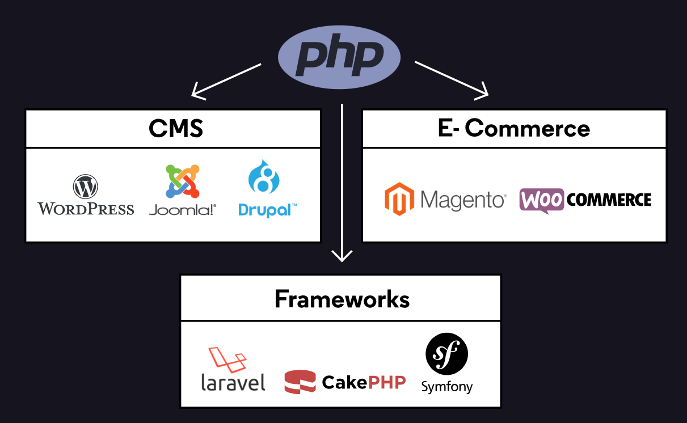
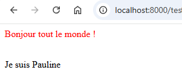
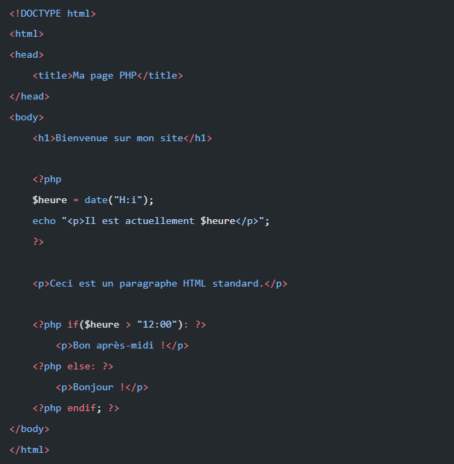
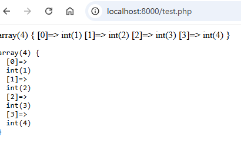

# Les fondamentaux de PHP

PHP (Hypertext Preprocessor) est un langage de programmation côté serveur populaire, particulièrement adapté au développement web


## Intro: L'utilisation de PHP

- `Langage côté serveur`: Le code est exécuté sur le serveur avant d’envoyer le HTML au client
- `Intégration avec HTML`: Peut être directement intégré dans les pages HTML
- Compatibilité avec les bases de données

## 1. Syntaxe et structure de base

- A PHP script starts with `<?php` and ends with `?>`
```php
<?php
  // Ton code PHP va ici
?>
```
- Les commentaires
```php
<?php

// Commentaires sur une ligne
/*
 Commentaire sur plusieurs lignes
 */
?>
```

- Chaque instruction se termine par un point-virgule `;`
- `echo` - affiche le rendu sur le navigateur (HTML)
```php
<?php
// L'instruction 'echo' permet d'afficher du texte ou du HTML à l'écran
  echo "<p style='color:red'>Bonjour tout le monde !</p>";
?>
```  


- `<br>`- Saut de ligne HTML
```php
<?php
echo "<p style='color:red'>Bonjour tout le monde !</p>"; 
echo '<br>';
echo "Je suis Pauline"
?>
```  


- PHP keywords (e.g. if, else, echo, etc.), classes, functions, and user-defined functions are `not case-sensitive`

- Intégration en HTML



## 2. Afficher des informations: `echo` VS `var_dump`

- `echo` - Envoie du texte ou du HTML au navigateur.

⚠️ **Attention** : echo ne prend en charge que les valeurs simples (les booléens, les nombres, et les chaînes de caractères - string). Il "plantera" si tu essaies de lui donner un tableau complexe.

```php
<?php
$nombre = 12;
$isTrue = true;
$string = "Hello";

// Echo affiche ces valeurs simples 
echo $nombre . "<br>";
echo $isTrue . "<br>";
echo $string . "<br>";
?>
```

- `var_dump` - pour le Debug.

C'est l'outil du développeur. Il sert à fouiller dans une variable pour afficher toutes ses infos (son type, sa taille, sa valeur). C'est indispensable pour **lire des tableaux**. *(L'équivalent du console.log en JS)*.

```php
<?php
$tableau = [1, 2, 3, 4];

// Affichage brut (sans la balise <pre>)
var_dump($tableau);

// Affichage propre (FORTEMENT RECOMMANDÉ)
// En encadrant le var_dump avec la balise HTML <pre>, l'affichage devient indenté et très lisible !
echo "<pre>";
var_dump($tableau);
echo "</pre>";
?>
```


- L'alternative : `print_r`

Ancienne fonction qui permet aussi d'afficher le contenu d'un tableau de manière lisible. Elle donne moins d'informations techniques que var_dump.
*À connaître pour lire du vieux code, mais beaucoup moins utilisé aujourd'hui.*

```php
PHP
<?php
print_r($tableau);
?>
```

## 3. Variables & Types de données

### a. Variables
- Commence toujours par `$`
- Pas besoin de déclarer le type (texte, nombre..), PHP le devine tout seul
- Variable are case-sensitive ($age and $AGE are 2 different variables)

```php
<?php
$prenom = "Pauline";     // String
$age = 38;              // Number (Integer)
$estConnecte = true;    // Booléen (Vrai ou Faux)

echo "Je m'appelle " . $prenom . " et j'ai " . $age . " ans."; 
// Le point (.) sert à "concaténer" (coller) des textes et des variables ensemble.
?>
```

### b. Constante

- Pas de symbole $ comme les variables
- S'écrit toujours en MAJUSCULES pour les différencier du reste

```php
<?php
// NOUVELLE VERSION (Recommandée, très similaire à JavaScript)
const TAUX_TVA = 20;
const SITE_NOM = "Mon Super Projet";

// ANCIENNE VERSION (Avec la fonction define, tu la verras dans de vieux codes)
define('ANCIENNE_CONSTANTE', 37);

// Affichage : ATTENTION, il n'y a pas de $ pour les appeler !
echo "Le taux de TVA est de " . TAUX_TVA . "%."; 
?>
```

### c. Manipulation des chaînes et nombres
#### - Concaténation: 
Se fait avec un point (`.`)

```php
<?php
$animal = "chat";

// Concaténation (avec le point)
echo 'J\'ai un ' . $animal . ' à la maison.'; 
?>
```


#### - Interpolation
Entre guillemets doubles `" "`, PHP lit la variable directement à l'intérieur du texte.

```php
<?php
$animal = "chat";

// Interpolation (uniquement avec les guillemets doubles " ")
echo "J'ai un $animal à la maison."; 
?>
```