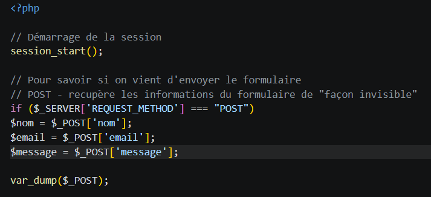
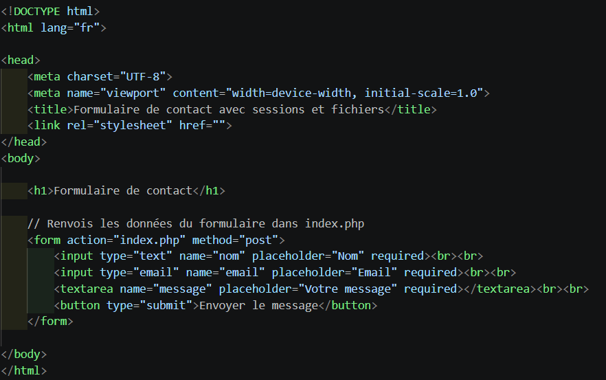
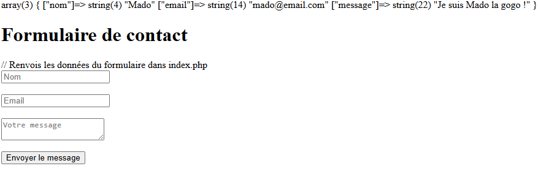

# Formulaire et sessions
C'est le lien entre l'utilisateur et le serveur

## 1. Formulaire

- Vérifier si le formulaire renvoi les données tapées par l'utilisateur: :

Etapes: 

- Remplir le formulaire 
- Cliquer sur "Envoyer le message"
- Avec `var_dump($_POST);` - la page va afficher exactement ce que le visiteur a tapé 

## 2. Sessions

3 étapes: 
- Démarrer une session
- Définir et récuperer des varibles de session
- Terminer une session et détruire les variables de session

### a. Démarrer une session
- `session_start()` - Pour démarrer une session

💡**Tip** : cette fonction doit obligatoirement être placée tout en haut de ton script, avant la moindre balise HTML ou espace blanc.

La gestion sécurisée des Formulaires

- `$_POST` - Récupère les données d'un formulaire de "façon invisible" en arrière plan (HTTP) vs `$_GET` = les données transitent de façon visible dans l'URL de la page 

Traiter un formulaire implique de bien choisir sa méthode d'envoi et, surtout, de sécuriser systématiquement les données reçues.

La méthode GET : Les données transitent de façon visible dans l'URL de la page. C'est utile pour des filtres de recherche ou des tris, mais à bannir pour des informations sensibles (comme un mot de passe). On récupère les informations avec la superglobale $_GET.

La méthode POST : Les données sont envoyées de manière "invisible" en arrière-plan (dans le corps de la requête). C'est la méthode standard pour les formulaires d'inscription ou de contact. On utilise le tableau $_POST.

Le danger (Faille XSS) : La règle d'or est de ne jamais faire confiance aux entrées utilisateurs. Quelqu'un pourrait taper du code JavaScript malveillant dans un champ texte pour pirater ton site.

La parade (htmlspecialchars) : Avant d'afficher une donnée reçue sur ton écran, il faut toujours utiliser la fonction htmlspecialchars(). Elle désamorce les balises HTML ou scripts malveillants en les transformant en texte inoffensif.

